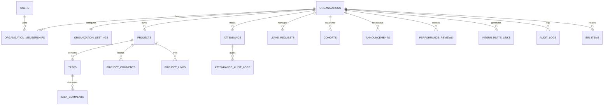

# InternHub B2B Multi-Tenant SaaS Architecture
## Technical Design & System Architecture Document

> **Document ID:** `INTERNHUB_SAAS_ARCHITECTURE.md`  
> **Status:** Approved Architecture Blueprint  
> **Version:** 2.0.0 (B2B SaaS Multi-Tenant)

---

## 1. System Topology & Tenancy Model

InternHub adopts a **Shared Application + Shared MySQL Database (Single Schema)** architecture with column-level tenant discriminator enforcement (`organization_id`).

```
                              REQUEST GATEWAY
┌─────────────────────────────────────────────────────────────────────────────┐
│ 1. SSL/TLS Termination + ProxyHeaders Middleware                            │
│ 2. Security Middleware (CSP, Strict-Transport-Security, Permissions-Policy) │
│ 3. CSRF Validation Middleware (Double-Submit Token via Header/Cookie)       │
│ 4. Bearer / Session Auth Verification (itsdangerous timed token)            │
│ 5. Tenant Context Resolver (X-Organization-Id Header / Primary Membership)  │
└──────────────────────────────────────┬──────────────────────────────────────┘
                                       │
                                       ▼
                             APPLICATION PIPELINE
┌─────────────────────────────────────────────────────────────────────────────┐
│ FastAPI Dependency Injection: RequestContext (User, Org, Membership, Roles) │
│                                      │                                      │
│ Routers (/api/*)                     │ Platform Super Admin (/api/platform/*)
│   ├── auth.py, attendance.py, etc.   │   ├── Manage Organizations           │
│                                      │   └── System Subscription / Status   │
│ Policy & RBAC Layer                  │                                      │
│                                      │                                      │
│ Service Layer (Domain Logic)         │                                      │
│                                      │                                      │
│ Tenant-Aware Repository Layer (Injects organization_id into all queries)    │
└──────────────────────────────────────┬──────────────────────────────────────┘
                                       │
                                       ▼
                             PERSISTENCE & STORAGE
┌──────────────────────────────────────┬──────────────────────────────────────┐
│ Shared MySQL 8.0+ Schema             │ S3-Compatible Cloud Storage (R2/S3)  │
│   ├── Platform Entities (orgs, users)│   └── org_{id}/attendance/photos/... │
│   └── Tenant Entities (org_id keyed) ├──────────────────────────────────────┤
│                                      │ APScheduler Tenant-Iterating Jobs    │
│                                      │   ├── Auto-checkout (org timezone)   │
│                                      │   ├── Overdue sweep (org timezone)   │
│                                      │   └── Bin purge (15-day expiry)      │
└──────────────────────────────────────┴──────────────────────────────────────┘
```

---

## 2. Identity & Membership Model

### 2.1 Entity Relationship Diagram (ERD)



### 2.2 Global Identity vs. Organization Membership
1. **`users` (Global Identity):** Stores identity and credentials (`email`, `password_hash`, `name`, `phone`, `session_version`, `is_platform_admin`).
2. **`organization_memberships` (Tenant Relationship):** Associates a user with a specific organization and role (`org_admin`, `mentor`, `intern`, `faculty`), tracking title, department, assigned mentor membership, and active state.

---

## 3. Role-Based Access Control (RBAC)

### 3.1 Role Hierarchy
- **`Platform Super Admin`:** System operator managing organizations, cross-tenant status, and platform health.
- **`Organization Admin`:** Full administrative control over members, settings, attendance corrections, and projects *within their organization*.
- **`Mentor / Faculty Coordinator`:** Manages assigned mentees and projects; evaluates reviews; reviews leave.
- **`Intern / Student`:** Self-service attendance, standup logging, task status progression, and leave requests.

---

## 4. Tenant Context & Isolation Architecture

### 4.1 Request Context Resolution
Every request automatically resolves the caller's context via `get_request_context`:
```python
@dataclass(frozen=True)
class RequestContext:
    user: User
    organization: Organization
    membership: OrganizationMembership
    role: str
    permissions: set[str]
    settings: OrganizationSettings
```

### 4.2 Strict Repository Isolation
All database access is executed through tenant-scoped repositories that automatically bind `organization_id`:
```python
class TenantRepository:
    def __init__(self, db: Session, org_id: int):
        self.db = db
        self.org_id = org_id

    def filter_scoped(self, model, *criterion):
        return self.db.query(model).filter(model.organization_id == self.org_id, *criterion)
```

---

## 5. Configurable Tenant Policies

Operational parameters are moved from `config.py` into `organization_settings`:
- **Shift Boundaries:** `shift_start` (default 10:00 AM), `shift_end` (7:00 PM), `late_cutoff` (10:30 AM), `noon_cutoff` (12:00 PM), `checkin_block` (8:00 PM).
- **Working Hours Calculation:** `full_day_hours` (7.0), `half_day_hours` (5.0).
- **Leave Policy:** `leave_quota_days` (15), `advance_notice_days` (1), `exclude_weekends` (True).
- **Verification Modes:** `require_attendance_selfie` (True), `require_attendance_gps` (True).
- **Timezone:** `organization.timezone` determines local midnight sweeps and cutoffs.
